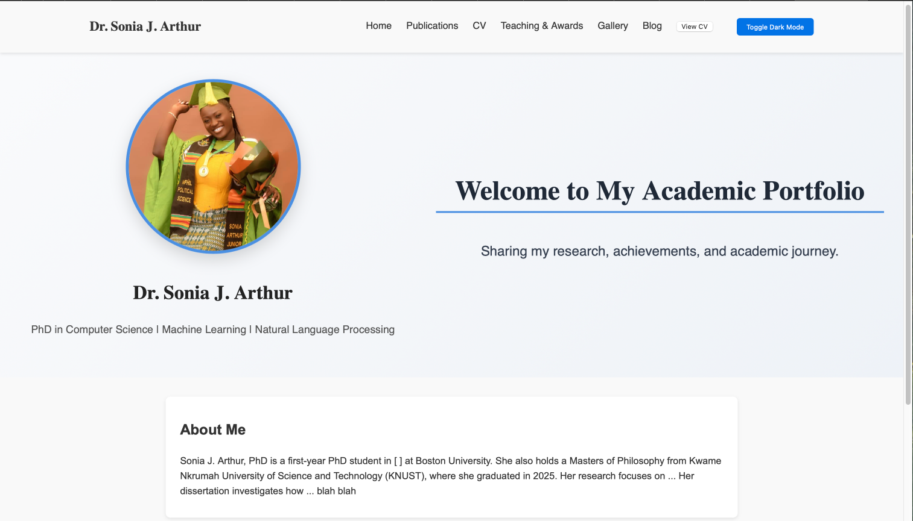
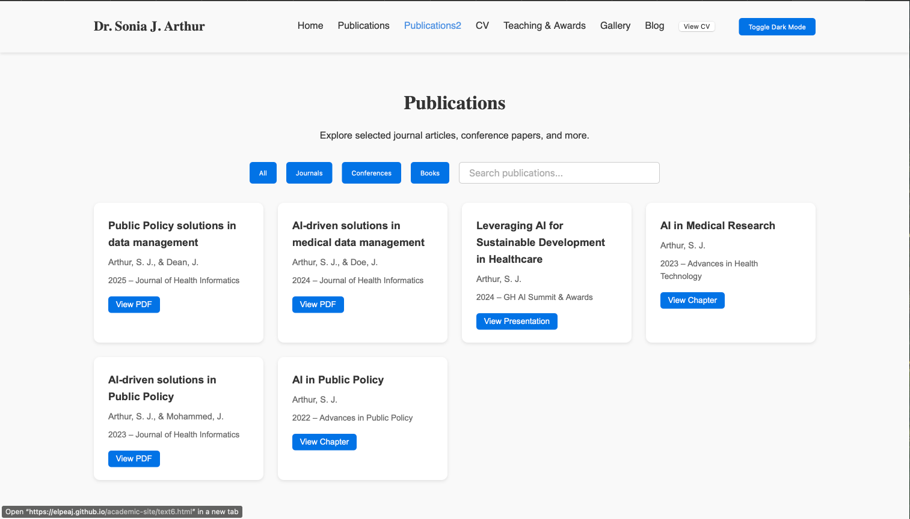
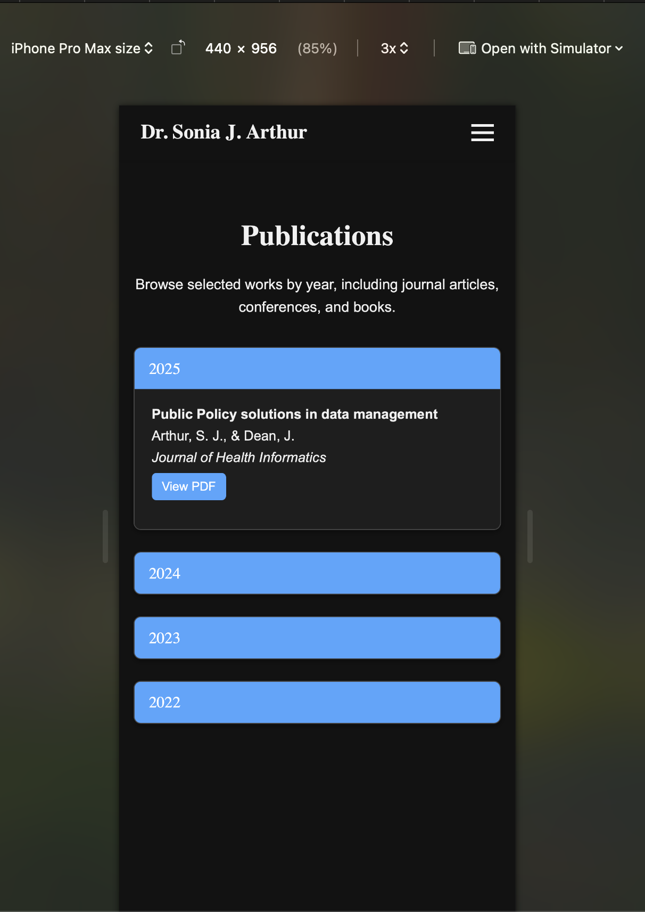
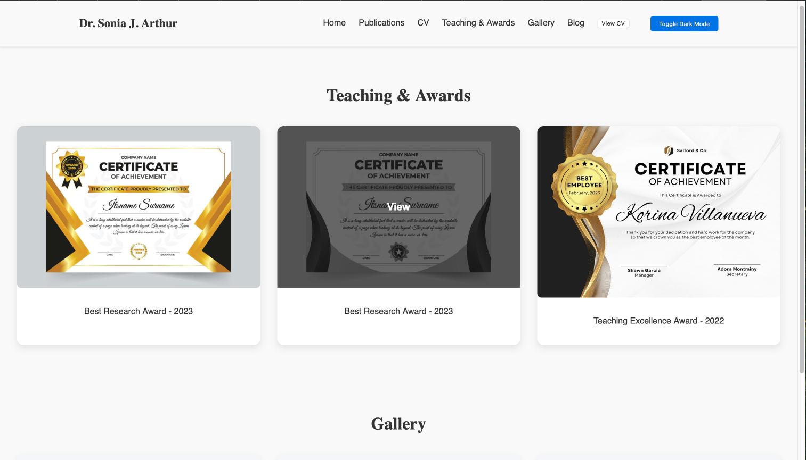

# Dr. Sonia Academic Portfolio Website  

This is a responsive academic portfolio website built for **Dr. Sonia**, a PhD student.  
The site showcases her research, publications, academic journey, and professional background in a clean, modern layout.  

## 🌐 Live Demo
[Visit Website](https://elpeaj.github.io/academic-site)

---

## 📖 Features
- **Homepage** with animated headings and typewriter introduction  
- **Responsive Navigation Bar** with hamburger menu for mobile devices  
- **Publications Page** with two layouts:
  - Grid-based cards with filters + search bar  
  - Chronological collapsible list grouped by year  
- **Dark/Light Theme Toggle**  
- **Mobile-first design** with smooth responsiveness  

---

## 🛠️ Technologies Used
- **HTML5**  
- **CSS3** (custom properties for theming, responsive grid & flexbox)  
- **JavaScript** (interactivity: theme toggle, collapsible sections, search, filters)  
- **Google Fonts** (Merriweather, etc.)  

---

## 📂 Project Structure
project-root/
│
├── index.html # Homepage
├── publications.html # Publications page
├── css/
│ └── styles.css # Main stylesheet
├── js/
│ └── script.js # Interactivity (theme toggle, search, filters)
└── assets/
  └── images/ # Images and icons
  └── pdfs/ # Documents


---

## 🚀 Setup & Usage
1. Clone the repository:
   ```bash
   git clone https://github.com/ElpeAJ/academic-site.git
2. Open index.html in your browser.
3. Or visit the GitHub Pages link

## 📌 Future Enhancements

    • Add downloadable CV/Resume page
    • Expand Publications with DOI integration (auto-fetch metadata)
    • Add Blog/News section for academic updates
    • Contact form with backend integration

## 🤝 Contributing

    • Contributions are welcome!
    • Fork the repository
    • Create a feature branch (git checkout -b feature-name)
    • Commit changes (git commit -m "Added feature")
    • Push to the branch (git push origin feature-name)
    • Open a Pull Request

## 📜 License

This project is licensed under the MIT License – feel free to use and adapt.

## 📸 Screenshots

### 🏠 Homepage


### 📚 Publications – Grid Layout


### 📖 Publications – Chronological List



